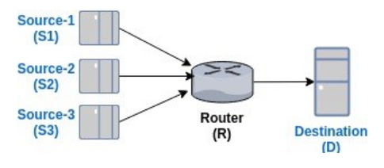
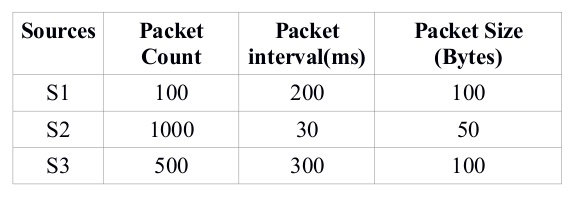
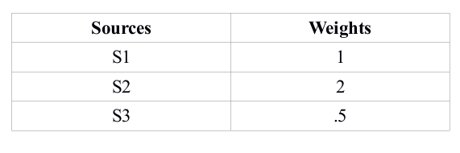

# Packet Queuing and Scheduling Algorithms
Packet Queuing and Scheduling Algorithms: **FIFO**, **Round Robin** and **Weight Fair Queuing (WFQ)**  
The below network model has been simulated and the above algorithms have been implemented on the router simulator.  

 </img>

The simulator assumes three sources **S1, S2 and S3** which transmit at a specific rate, and send a given number of packets (see table below) at different intervals via different paths/queues. **R** extracts the payloads and forwards to **destination (D)**   using the above mentioned scheduling algorithms via a single path/queue. We've used UDP sockets for the IPC.  

 </img>

Also, we assume the following weights assigned to the packets from the three different sources.  

 </img>

Each source sends a payload, with the first byte indicating the source number i.e. "1ksdfsdfsdfu" implies that the packet arrived from S1.  

### To run
- Compile the source and destination files with `make`
- Run in the following order  
  - `./destination`
  - `python rr.py` or `python fifo.py` or `python WFQ.py`
  - `./sources`
The destination process will output the source packet names.
